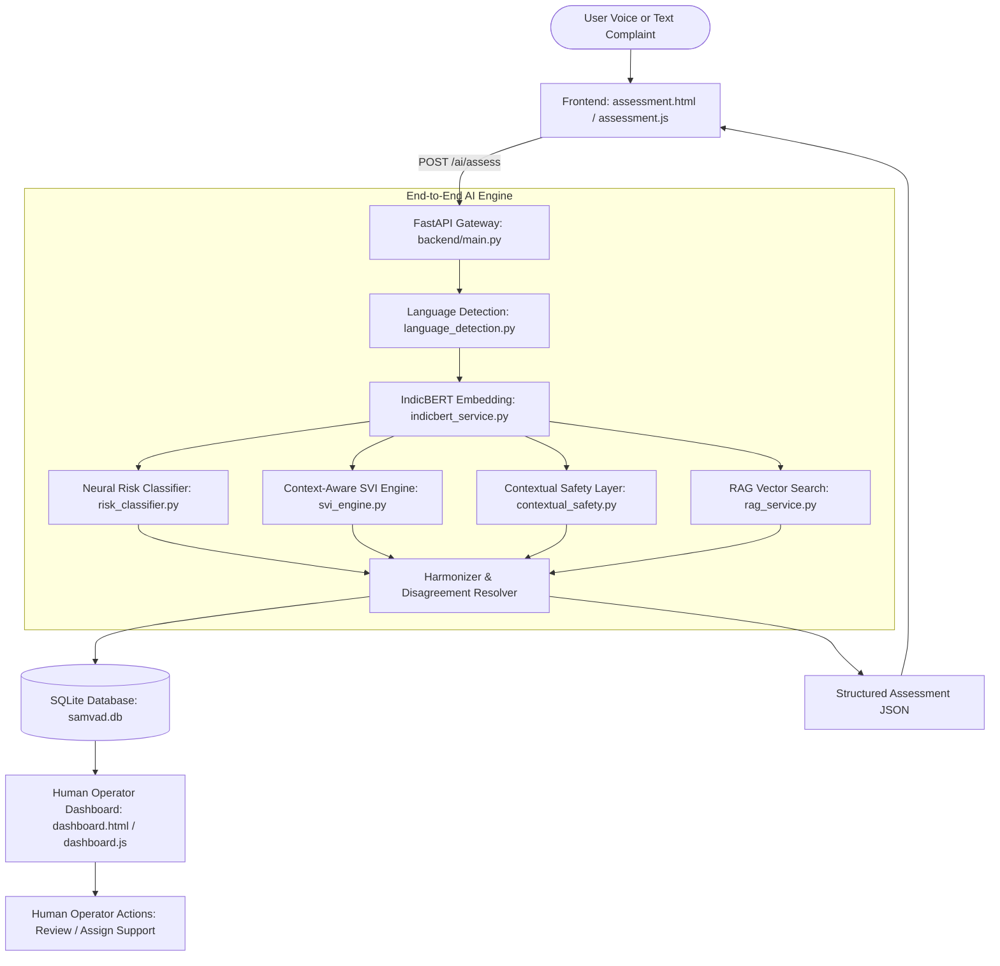

# SAMVAD AI — Step 12: Deployment Readiness Audit Document

**Evaluation Date**: 2026-09-15  
**Version**: 1.0.0-prototype  
**Status**: Comprehensive Pre-Deployment Inspection  

---

## Executive Summary & Deployment Status

| Deployment Category | Audit Status | Critical Findings |
|---|---|---|
| **1. Environment Configuration** | ⚠️ **WARNING** | Backend URLs were previously hardcoded to `http://127.0.0.1:8000`. Configured `window.SAMVAD_API_BASE_URL` with local fallback. Environment variables now formalized. |
| **2. Secret Management** | 🟢 **PASS** | Zero credentials or tokens found hardcoded in source code. Bhashini integration uses `os.environ`. `.env.example` created. |
| **3. Frontend → Backend Connectivity** | 🟢 **PASS** | Frontend modules (`assessment.js`, `dashboard.js`, `js/dashboard.js`) now dynamically resolve `window.SAMVAD_API_BASE_URL` while preserving `http://127.0.0.1:8000` for local dev. |
| **4. CORS Configuration** | ⚠️ **WARNING** | Development defaults to `allow_origins=["*"]`. Production requires restricting via `ALLOWED_ORIGINS` environment variable. |
| **5. Database Layer** | 🛑 **BLOCKER for Multi-User Prod** | Current persistence uses single-file SQLite (`backend/samvad.db`). SQLite is suitable for demo/single-node local use, but blocks concurrent multi-worker public deployment. Requires PostgreSQL migration. |
| **6. Model Deployment & Resources** | 🛑 **BLOCKER for Low-RAM Hosting** | IndicBERT (`ai4bharat/IndicBERTv2-MLM-only`) requires ~480 MB storage, ~2.5–4.0 GB active RAM, and CPU/GPU resources. Cannot run on standard 512MB free-tier micro-containers. |
| **7. RAG Knowledge Layer** | 🟢 **PASS** | Curated `documents.json` and precomputed `vector_cache.pt` verified. Cosine thresholding prevents hallucination (0 documents returned for out-of-domain queries). All content explicitly marked as prototype demo data. |
| **8. Bhashini Speech-to-Text** | 🟢 **PASS** | Graceful dual-route architecture verified. Unconfigured credentials return safe `status: not_configured` and fall back to browser Web Speech API without user disruption. |
| **9. API Health & Contracts** | 🟢 **PASS** | All 7 primary endpoints (`/health`, `/ai/assess`, `/ai/classify-risk`, `/ai/retrieve-support`, `/ai/detect-language`, `/ai/transcribe`, `/cases`) verified returning HTTP 200. |
| **10. Security & Privacy Audit** | ⚠️ **WARNING** | No authentication/authorization currently implemented (open prototype). No personal identifiers or raw sensitive statements are logged. Exception handlers should suppress internal traces in production. |

### Overall Deployment Status
**DEPLOYMENT STATUS: NOT READY (For Public Multi-User Production)**  
**LOCAL / DEMO DEPLOYMENT: READY**

---

## 1. Current Architecture



### Voice Ingestion Path
```
User Audio -> Bhashini ASR (if credentials set) -> Transcribed Text -> /ai/assess
            -> Browser Web Speech API (fallback) -> Transcribed Text -> /ai/assess
```

---

## 2. Local Development Setup

1. **Prerequisites**:
   - Python 3.10+ (tested on Python 3.14)
   - Node.js 18+
2. **Install Python Dependencies**:
   ```bash
   pip install -r backend/requirements.txt
   ```
3. **Run Backend Server**:
   ```bash
   python -m uvicorn backend.main:app --host 127.0.0.1 --port 8000 --reload
   ```
4. **Access Web Application**:
   - Open `index.html` or `assessment.html` in any modern web browser or serve via static HTTP server:
   ```bash
   npx serve .
   ```
5. **Human Operator Dashboard**:
   - Navigate to `dashboard.html` (`http://localhost:3000/dashboard.html` or direct file).

---

## 2A. Docker Container Execution Instructions

### 1. Build the Docker Image (CPU-Only PyTorch)
```bash
docker build -t samvad-ai-backend:latest .
```

### 2. Run Container Locally
```bash
docker run -d \
  --name samvad-backend \
  -p 7860:7860 \
  -e PORT=7860 \
  -e ENVIRONMENT=production \
  -e ALLOWED_ORIGINS=http://localhost:3000,http://127.0.0.1:8000 \
  samvad-ai-backend:latest
```

### 3. Verify Container Health
```bash
curl -f http://127.0.0.1:7860/health
```

### 4. Stop and Remove Container
```bash
docker stop samvad-backend && docker rm samvad-backend
```

---

## 3. Required Environment Variables

All production environment variables are template-documented in [`.env.example`](file:///d:/sih/SAMVAD%20AI/.env.example):

| Variable | Required in Prod? | Default (Development) | Purpose |
|---|---|---|---|
| `HOST` | Optional | `127.0.0.1` | Network interface for Uvicorn |
| `PORT` | Optional | `8000` | Listening port |
| `ENVIRONMENT` | **Yes** | `development` | `development` or `production` |
| `ALLOWED_ORIGINS` | **Yes** | `*` | Comma-separated list of permitted frontend URLs for CORS |
| `DATABASE_URL` | **Yes** | `sqlite:///backend/samvad.db` | Relational database connection URI (e.g. PostgreSQL) |
| `BHASHINI_USER_ID` | Optional | `None` | Digital India Bhashini user ID |
| `BHASHINI_API_KEY` | Optional | `None` | Digital India Bhashini service API key |
| `BHASHINI_INFERENCE_API_KEY` | Optional | `None` | Digital India Bhashini pipeline inference key |
| `BHASHINI_PIPELINE_ID` | Optional | `64392f96daac503b137db368` | Bhashini ASR pipeline identifier |
| `INDICBERT_MODEL_NAME` | Optional | `ai4bharat/IndicBERTv2-MLM-only` | Hugging Face model repository or local directory path |
| `RISK_CLASSIFIER_WEIGHTS_PATH`| Optional | `backend/models/risk_classifier_head.pt` | Path to trained neural classification weights |
| `RAG_KNOWLEDGE_FILE` | Optional | `backend/knowledge/documents.json` | Path to curated grounded support documents |
| `RAG_VECTOR_CACHE` | Optional | `backend/knowledge/vector_cache.pt` | Precomputed PyTorch vector embeddings cache |

---

## 4. Frontend Configuration

### Dynamic Backend Base URL
To eliminate hardcoded `http://127.0.0.1:8000` dependencies when hosting frontend assets on a CDN, Cloudflare Pages, Vercel, or Nginx:
- Frontend scripts (`assessment.js`, `dashboard.js`, `js/dashboard.js`) dynamically check:
  ```javascript
  var BACKEND_API_BASE = (typeof window !== "undefined" && window.SAMVAD_API_BASE_URL)
    ? window.SAMVAD_API_BASE_URL
    : "http://127.0.0.1:8000";
  ```
- **In Production Deployment**: Inject configuration in `<head>` before scripts load:
  ```html
  <script>
    window.SAMVAD_API_BASE_URL = "https://api.samvad.example.gov.in";
  </script>
  ```
- **In Local Development**: No modification required; defaults seamlessly to `http://127.0.0.1:8000`.

---

## 5. Backend Deployment Requirements

1. **ASGI Application Server**:
   - Uvicorn or Gunicorn with Uvicorn workers:
     ```bash
     gunicorn -w 2 -k uvicorn.workers.UvicornWorker backend.main:app --bind 0.0.0.0:8000 --timeout 120
     ```
   - **Worker Sizing**: IndicBERT requires ~1.2 GB per worker process. Avoid spawning 8+ workers on memory-constrained servers. Recommend 2 workers on a 8 GB instance.
2. **Reverse Proxy (Nginx / Caddy / Cloudflare)**:
   - Terminate SSL/TLS (`https://`).
   - Enforce HTTP request size limit (`client_max_body_size 25M;` for audio uploads).
   - Configure proxy timeouts (`proxy_read_timeout 60s;` for cold-start deep neural inference).

---

## 6. Database Requirements

### Current State (SQLite)
- SQLite file located at `backend/samvad.db`.
- Automatic schema column synchronization (`ensure_schema_columns()`).
- **Limitation**: SQLite operates on file-level locks. In multi-worker (`gunicorn -w 4`) or multi-container horizontal scale, concurrent write operations can encounter `database is locked` (`OperationalError`).

### Production Architecture Requirement
- Migrate to **PostgreSQL 14+** (e.g. AWS RDS, Azure Database for PostgreSQL, Supabase, Neon).
- Install PostgreSQL driver: `psycopg2-binary` or `asyncpg`.
- Configure connection pooling via SQLAlchemy:
  ```python
  engine = create_engine(
      DATABASE_URL,
      pool_size=10,
      max_overflow=20,
      pool_recycle=1800,
  )
  ```
- Use Alembic for declarative schema migrations.

---

## 7. Model Requirements & Sizing

| Component | Storage Size | Memory Footprint | Runtime Requirement |
|---|---|---|---|
| **IndicBERT Base** (`ai4bharat/IndicBERTv2-MLM-only`) | 480 MB | ~2.5 GB RAM | PyTorch, HuggingFace `transformers`, `sentencepiece` |
| **Risk Classification Head** (`risk_classifier_head.pt`) | 405 KB | ~10 MB RAM | PyTorch Linear/MLP layers |
| **RAG Vector Cache** (`vector_cache.pt`) | 39 KB | < 1 MB RAM | PyTorch tensor (10 documents × 768 dims) |

### Minimum Hardware Sizing
- **Minimum VM / Container**: 2 vCPUs, **4 GB RAM**, 10 GB SSD.
- **Recommended VM / Container**: 4 vCPUs, **8 GB RAM**, 20 GB SSD (or 1 NVIDIA T4 GPU for <30ms sub-second latency).
- **Not Supported**: Serverless functions with < 15s execution limits or containers with < 2 GB RAM (e.g. AWS Lambda without container provisioning, Vercel Serverless Functions).

---

## 8. Bhashini Speech-to-Text Configuration

- **Zero Credential Exposure**: No API keys are stored in the codebase or transmitted to the client.
- **Environment Driven**: Authenticates via `BHASHINI_API_KEY` + `BHASHINI_USER_ID`, or `BHASHINI_INFERENCE_API_KEY`.
- **Safe Fallback**: When environment variables are missing, `GET /ai/transcribe` returns `status: "not_configured"`.
- **Client Auto-Switching**: The frontend checks this status on startup. If unconfigured, voice input immediately routes to the browser's built-in Web Speech API (`webkitSpeechRecognition`) without user disruption.

---

## 9. RAG & Knowledge Base Verification

- **Curated Knowledge Items**: 10 bilingual documents in `backend/knowledge/documents.json`.
- **Strict Grounding**: Zero hallucination design. Minimum cosine similarity threshold (`0.28`) ensures out-of-domain queries return `results: []`.
- **Data Integrity**: All documents contain `"source_type": "prototype_demo"` and explicit disclaimers. No fabricated government legislation or false institutional affiliations are presented as authoritative law.

---

## 10. CORS & Network Security Requirements

- **Current State**: `backend/main.py` is configured with dynamic CORS:
  ```python
  allowed_origins_env = os.environ.get("ALLOWED_ORIGINS")
  if allowed_origins_env and allowed_origins_env.strip():
      origins = [orig.strip() for orig in allowed_origins_env.split(",") if orig.strip()]
  else:
      origins = ["*"]
  ```
- **Production Requirement**: Set `ALLOWED_ORIGINS` in `.env` to explicit domains only:
  ```bash
  ALLOWED_ORIGINS=https://samvad.gov.in,https://dashboard.samvad.gov.in
  ```

---

## 11. Known Deployment Blockers (Why Public Prod is "NOT READY")

1. **Database Multi-Worker Concurrency**: Single-file SQLite is not safe for high-traffic multi-process deployment.
2. **Missing Operator Authentication**: The operator dashboard (`dashboard.html`) and endpoints (`/cases`) lack Role-Based Access Control (RBAC) or session authentication. Anyone with network access can view persisted complaints.
3. **Unprotected File Upload Limits**: `POST /ai/transcribe` audio uploads need reverse-proxy rate limiting and strict body-size limits to prevent denial-of-service.
4. **Memory Requirements Exceed Micro Tiers**: Free hosting tiers (512MB RAM) will crash immediately due to IndicBERT memory allocation.
5. **No Persistent SSL/TLS Certificate**: Must be terminated via reverse proxy or cloud load balancer.

---

## 12. Recommended Production Deployment Architecture

```
Internet / Citizen Mobile & Web
           │
           ▼
[Cloudflare CDN & DDoS Protection / WAF]
           │
           ▼
[Nginx Reverse Proxy (SSL Termination, Rate Limiting, 25MB Body Cap)]
           │
     ┌─────┴──────────────────────────┐
     │                                │
     ▼                                ▼
[Frontend Static Assets]      [FastAPI Gunicorn Workers (x2)]
(S3 / Cloudflare Pages / CDN) (Docker Container on 4GB-8GB VM)
                                      │
                         ┌────────────┼────────────┐
                         ▼            ▼            ▼
                   [PostgreSQL] [IndicBERT]   [Bhashini ASR]
                   (AWS RDS)   (Local Cache)   (MeitY API)
```

---

## 13. Prototype & Ethical Operational Limitations

> [!IMPORTANT]
> - **AI-Assisted Decision Support Only**: SAMVAD AI is an administrative prioritization and decision-support prototype. It does **not** diagnose psychological disorders, make psychiatric evaluations, or provide autonomous legal or emergency dispatch determinations.
> - **Mandatory Human Verification**: All flagged critical and high cases require verification by qualified human case officers.
> - **Data Privacy & Retention**: Complaints must be stored in compliance with applicable digital personal data protection frameworks. PII masking and periodic data pruning should be implemented prior to handling live citizen complaints.
